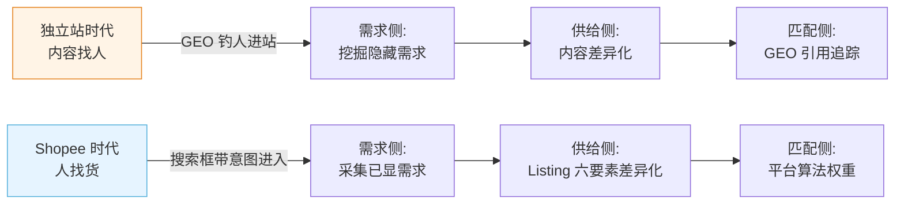
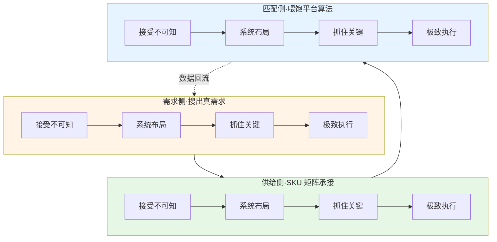
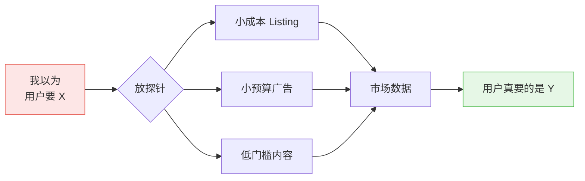
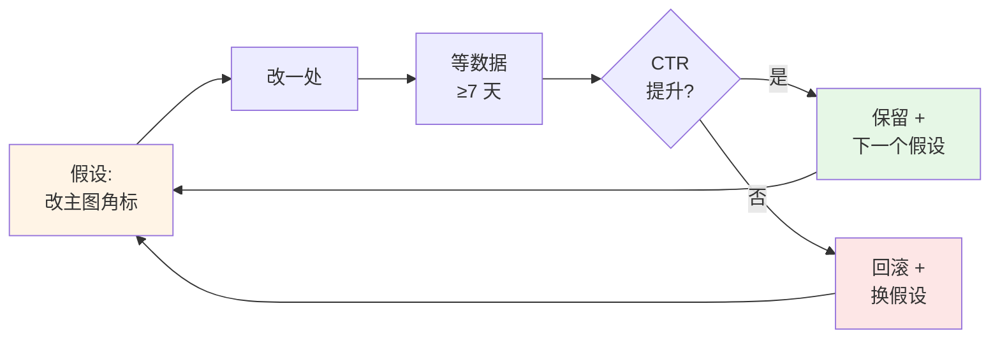
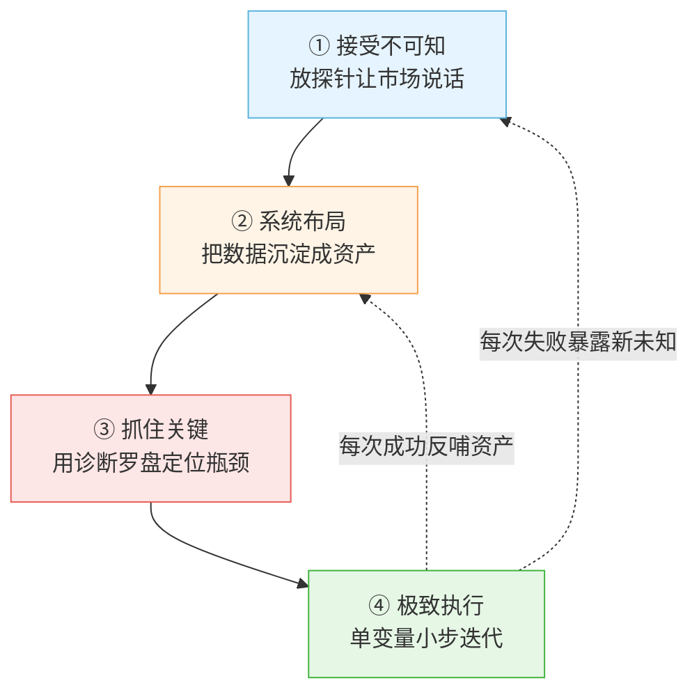

# **《Shopee 方法论沉淀文档 v1.0》**

> 一台可跨平台、跨品类、自迭代的"撮合供需的机器"
>
> 沉淀时间：2026 年 6 月

---

## **第零章 · 序言：这台机器为什么能跨平台复用**

### **0.1 这份文档不是写给一个品的**

很多人写电商方法论，写到最后只能服务于自己手里那一个品、那一个店。一旦换品类、换平台，整套方法论就失效——这说明它从一开始就不是方法论，只是一份"操作手册"。

真正的方法论必须满足一个条件：**齿轮本身不变，变的只是填进齿轮里的内容**。

这份文档要沉淀的，是那台齿轮。**黑胶独立站是它跑过的第一个测试场，Shopee 缝纫配件是第二个，后面还会有第三个、第四个。** 你真正拥有的不是某一个站、某一个品类，而是这台"换个场景就能重新转起来"的机器本身。

### **0.2 跨平台迁移最关键的差异：不是改方法论，是改齿轮里的内容**

把这台机器从独立站搬到 Shopee，最大的陷阱是照搬。原因在于平台的底层逻辑发生了根本性反转：

这个反转带来三个核心差异，必须在每一端都重新校准：

- **验证场不同**：独立站靠"软反馈"间接推断（内容引用率），Shopee 靠"硬数据"直接验证（曝光/CTR/CVR 三个数）。
- **差异化落点不同**：独立站差异化落在内容结构上，Shopee 差异化必须落到平台允许你控制的那六个要素——**主图、标题、价格、卖点、详情、评价**。
- **验证顺序不同**：独立站是"先挖需求 → 再做供给"的串行验证，Shopee 是"上架那一刻需求和供给被同时验证"的并行验证。

### **0.3 三大端口与四步齿轮的咬合**

这套方法论的全貌可以用一张图说清楚：

**3 端 × 4 步 = 12 格矩阵**，每一格都是一个具体动作。本文档接下来的章节，就是把这 12 格逐一填满。

### **0.4 飞轮的本质：诊断要勤，优化要稳**

很多人把"飞轮"理解成"不停改"——错了。飞轮转得起来的前提是**诊断和优化分离**：

- **诊断要勤**：每天扫异常、每周定瓶颈、每月看趋势——目的是不漏诊，但看到波动先别动手。
- **优化要稳**：数据够了才动手，一次只改一个变量——目的是不误治，每次改动都能精准归因。

**看得勤是为了不漏诊，动得稳是为了不误治。** 这是飞轮的呼吸节奏，每一端都要遵守。

> **【缝纫包注脚】** 这套机器在缝纫包这个 SKU 上的具体形态：需求侧是"扒 Shopee 印尼站的 sewing 联想词"，供给侧是"用 Listing v3.1 Skill 批量生成 30 个长尾 SKU"，匹配侧是"开关键词广告 + 监控曝光/CTR/CVR"。但请记住——这只是机器在这一个 SKU 上的具体形态，机器本身不属于缝纫包。

---

## **第一章 · 顶层方法论：四步通用齿轮**

这一章只讲齿轮本身。后面三大端的所有动作，都是把这四步在不同场景下的具体翻译。

### **1.1 第一步：接受不可知**

**核心定义**：放弃"我能想清楚再开始"的幻觉，承认市场比你聪明，把决策权交给数据。

**为什么这是第一步**：所有创业者都有一个本能错误——觉得自己想得越透彻、计划越完美，就越容易成功。但市场是高维博弈系统，你永远算不全所有变量。**接受不可知，不是认输，是把"我以为"和"事实"做切割**——把脑子里那个"我觉得用户应该……"先封存，让真实数据告诉你答案。

**这一步的反面教材**：花两周写商业计划书、做用户画像 PPT、辩论"目标人群是 25-35 岁还是 18-30 岁"。这些动作都在试图"想清楚"，但本质是在拖延，把"开始"无限推后。

**这一步的正确动作**：用最小成本的探针去问市场，让市场用数据回答。探针可以是一篇内容、一个 Listing、一次广告投放，关键是**成本足够低、反馈足够快、信号足够清**。

> **【缝纫包注脚】** 在 Shopee 上，"接受不可知"不是猜印尼买家想要什么样的缝纫包，而是先到 Shopee 搜索框打 "sewing"、"jahit" 这些种子词，把下拉联想词和相关搜索全部抄下来——**联想词是平台用真实搜索量给你排好序的"市场答案"**，不需要你猜。

---

### **1.2 第二步：系统布局**

**核心定义**：在动手之前先建底层资产，让所有后续动作能在资产之上复用、累积、自我增强。

**为什么这是第二步**：接受不可知之后，你会拿到一堆零散的数据点。如果不做系统布局，这些数据点会随风散去——这周有点感觉，下周又忘了。**系统布局是把数据点结构化，沉淀成"图书馆"，每一次新动作都能站在前一次的肩膀上。**

**这一步的反面教材**：每天看数据，但所有数据都在 Excel 临时表里，一周后回头找不到了；每次写 Listing 都从零起手，没有模板没有词库；每次复盘都靠记忆，没有看板。

**这一步的正确动作**：建三种基础设施——**词库 / 模板 / 看板**。词库管"原材料"，模板管"生产工艺"，看板管"反馈信号"。三者就位之后，你的每一次决策都是基于资产，而不是基于直觉。

> **【缝纫包注脚】** 系统布局在缝纫包项目上具体落地：①建一张"缝纫配件四层分层词库"（表层/场景层/情绪层/身份层），所有词带搜索量和竞争度标注；②把 Listing v3.1 Skill 固化下来作为生产模板；③建一张 SKU 数据监控看板，追踪每个 SKU 的曝光/CTR/CVR。这三件资产建一次、复用无数次。

---

### **1.3 第三步：抓住关键**

**核心定义**：永远只优化漏斗里漏水最狠的那一环，拒绝四面出击。

**为什么这是第三步**：有了系统资产之后，最容易犯的错是"看哪里都想改一改"——一天改主图、第二天改标题、第三天改价格、第四天又改主图。结果是一周过去，每个变量都动过，但**没有一个变量能拿到干净的归因**，你不知道哪个改动起了作用。

**抓住关键的本质是诊断罗盘**——用三个数据指标精准定位问题在哪一环：

| 数据指标 | 反映哪个要素出问题 | 该改什么 |
|---|---|---|
| **曝光低** | 标题关键词没覆盖到 / 词选错 | 改标题、换长尾词 |
| **有曝光、CTR 低** | 主图或价格没吸引力 | 改主图、调价格 |
| **有点击、CVR 低** | 卖点/详情/评价没说服力 | 改卖点、补详情、攒评价 |

**这一步的铁律**：哪个数差，就改对应的那个要素，不要四个一起瞎改。一次只动一个变量，才知道是哪个改动起了作用——**这是 A/B 测试的铁律，也是抓住关键的具体操作形态**。

> **【缝纫包注脚】** 缝纫包 SKU 上线一周后，看后台数据：曝光 3000、CTR 2.1%（行业均值 4.5%）、CVR 1.8%。诊断罗盘直接告诉你——曝光够，但 CTR 远低于均值，**问题在主图，不在标题、不在详情**。下一步只动主图（A/B/C 三版测试），其他要素一概不动，直到 CTR 跑过均值再去看 CVR。

---

### **1.4 第四步：极致执行**

**核心定义**：高频小步测试，低频大改，让方法论在持续迭代中越转越准。

**为什么这是第四步**：抓住关键之后，"改"这个动作本身也有节奏。**改太勤** = 数据样本不够，每次改动都在噪音里；**改太慢** = 错过迭代窗口，被对手超越。极致执行不是"使劲改"，是"按节奏改"。

**这一步的核心节奏**：

**这一步的两个铁律**：

1. **数据样本铁律**：每个变量改动后至少累积几百次曝光、跑满 7 天，才有统计意义。改完第二天就回头看数据 = 自欺欺人。
2. **单变量铁律**：一次只改一个变量。如果同时改了主图和标题，CTR 提升了你也不知道是谁的功劳，下次复用就会失灵。

**这一步和"系统布局"的呼应**：极致执行越是高强度，你的"系统资产"就越增值——每一次成功的改动会被沉淀进模板，每一次失败的改动会被沉淀进禁忌清单，资产越用越厚。

> **【缝纫包注脚】** 缝纫包 Listing 主图 A 版（卖点放大型）跑了 7 天，曝光 5000、CTR 2.8%；切到 B 版（场景代入型）再跑 7 天，曝光 5200、CTR 4.6%。数据足够明显——保留 B 版，把"场景代入比卖点放大更打印尼买家"这条经验写进《Shopee 视觉策略禁忌清单》，下次新品直接从 B 版起手，不再走 A 版的弯路。

---

### **1.5 四步之间的咬合关系**

这四步不是线性流程，而是一个闭环：

四步不是"做完一步换下一步"，而是**第四步永远在反哺前三步**——每一次极致执行都会暴露新的不可知（回到第一步）、给系统资产添新内容（回到第二步）、改变诊断罗盘的下一个目标（回到第三步）。

**这就是飞轮转起来的内核：四步本身就是飞轮的四个齿。**

> **【缝纫包注脚】** 缝纫包项目跑完一轮：从联想词采集（接受不可知）→ 建分层词库和 Listing 模板（系统布局）→ 发现 CTR 是瓶颈（抓住关键）→ 主图 A/B/C 测试拿到 B 版获胜（极致执行）→ "场景代入更有效"成为新假设，反哺到第二品的需求侧重新探索。**机器没停，只是从缝纫包转到了下一个 SKU。**

---

### **【第零章 + 第一章 · 完】**
