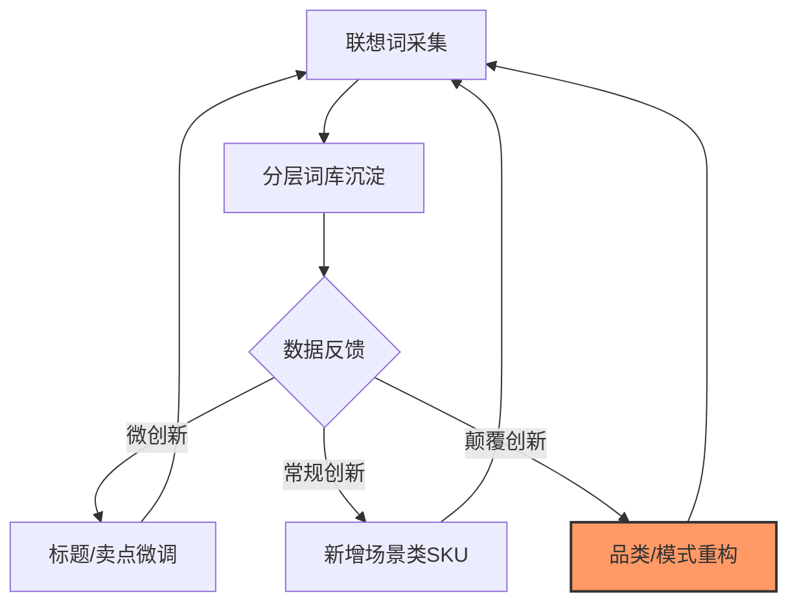

## **第二章 · 需求侧：搜出真需求**

### **2.1 用四步方法论跑需求侧**

在平台电商场景下，需求侧的本质是**“采集与分层”**。你不需要创造需求，只需要像矿工一样把用户已经表达出来的意图（搜索词）开采出来并结构化。

#### **① 接受不可知：从“我以为”转向“搜索联想”**
不要假设印尼买家想要什么，直接去问算法。
- **动作**：在 Shopee 搜索框输入种子词（如 `sewing`），抄下所有下拉联想词。
- **逻辑**：联想词是平台根据真实搜索量排好序的“答案”。如果联想词里出现了 `sewing kit for jeans` 而没出现 `sewing kit for silk`，那就证明前者是真需求，后者是伪命题。

#### **② 系统布局：建立“分层关键词库”**
采集到的词如果只是散乱的列表，就无法指导选品和 Listing。必须按**表层、场景层、情绪层、身份层**进行分层标注。
- **逻辑**：这是多 SKU 长尾策略的地基。分层能让你看清哪些词是红海（避开），哪些词是蓝海（主攻），哪些词是卖点来源（抄进文案）。

#### **③ 抓住关键：锁定“高搜索 × 低竞争 × 高意图”**
并不是所有长尾词都值得做。用三个维度过滤出“靶心词”：
- **维度**：搜索量（需求真）、竞争商品数（蓝海）、购买信号（词里带 `buy` / `set` / `for...`）。
- **逻辑**：只把精力压在“有肉吃、对手少、买意强”的那 20% 关键词上。

#### **④ 极致执行：用“小批量上新”当需求探针**
不要憋大招，直接上架 Listing 去测。
- **动作**：挑 20~30 个靶心词，每个词对应一个 Listing，给极小预算的关键词广告。
- **逻辑**：看自然曝光的增长速度。哪个 Listing 跑得最快，哪个词就是“真金白银”的需求，后续往这个方向补更多 SKU。

> **【缝纫包注脚】** 
> 1. **采集**：输入 `jahit`（印尼语缝纫），发现联想词里 `alat jahit portable` 排名极高。
> 2. **分层**：将 `sewing kit` 标为表层，`for jeans repair` 标为场景层，`heavy duty needles` 标为情绪层。
> 3. **选靶**：发现 `portable sewing kit for beginners` 搜索量中等但竞品极弱，定为第一批 20 个 SKU 的核心方向。

---

### **2.2 需求侧的时间节奏（日/周/月动作清单）**

需求侧的节奏在于**“高频采集，低频重构”**。

| 周期 | 诊断动作（看） | 优化动作（动） | 目的 |
|---|---|---|---|
| **每日** | 扫一眼核心长尾词的搜索排名 | 无（除非排名暴跌） | 监控异常，保持敏感度 |
| **每周** | 导出本周自然流量来源词表 | 补充 3-5 个新发现的潜力长尾词入库 | 捕捉搜索趋势的微小波动 |
| **每月** | 重新跑一遍种子词下拉联想 | **重构分层词库**，剔除死词，升级新身份层 | 确保地基资产不因季节或流行而失效 |

---

### **2.3 需求侧的飞轮：从微创新到颠覆**

需求侧的飞轮转起来，意味着你对用户意图的理解越来越深。

- **微创新（每周）**：在现有词库里发现一个新修饰词（如 `travel size`），立刻把它加进 5 个 Listing 的标题末尾测 CTR。
- **常规创新（每月）**：发现一个新的“场景层”交叉点（如 `sewing kit for student dorm`），为此专门打包一个新的 SKU 组合上架。
- **颠覆性创新（每季度）**：通过搜索数据发现用户不再搜“配件”，转而搜“成品 DIY 方案”，果断从“卖工具”跨越到“卖手工材料包”，实现维度打击。

---

### **本章总结：四步咬合**

需求侧的四步咬合，本质上是**“把不确定的市场意图，沉淀为确定的词库资产”**的过程。

- **接受不可知** 让你不至于陷入主观偏见。
- **系统布局** 让你的搜索流量有据可依。
- **抓住关键** 保证了投入产出比。
- **极致执行** 让你通过实战不断修正词库的准确性。

> **【缝纫包注脚】** 如果你不跑这四步，你可能永远在卷 `sewing kit` 这个大词；跑完之后，你手里握着的是 `portable heavy duty jeans repair kit` 这种精准流量入口。**这就是机器的力量。**

---

**【第二章 · 完】**
