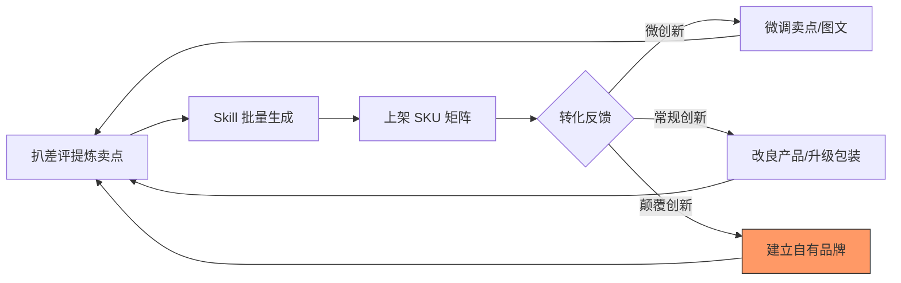

## **第三章 · 供给侧：用 SKU 矩阵承接需求**

### **3.1 用四步方法论跑供给侧**

供给侧的本质是**“差异化映射”**。你需要把需求侧挖到的痛点和场景，精准地翻译成 Listing 的六个要素。

#### **① 接受不可知：从“组合化 SKU”开始测试**
不要假设哪种打包方式最畅销，让用户用钱包投票。
- **动作**：针对同一个产品，测试三种供给形态：单品（极致低价）、场景包（如牛仔裤专用）、人群包（如初学者全套）。
- **逻辑**：哪种结构转化好、客单价高，数据会告诉你。这就是供给侧的模块化组合测试。

#### **② 系统布局：建立“Listing 工业化生产能力”**
多 SKU 策略最大的成本是文案生产。你必须把内容生产系统化。
- **动作**：固化 **Listing v3.1 Skill**。只要输入长尾词和产品参数，就能瞬间产出符合 Shopee 规则的标题、卖点、详情和生图提示词。
- **逻辑**：别人手写一天 5 个，你系统化生成一天 50 个。规模化是长尾策略的核心护城河。

#### **③ 抓住关键：在“对手最烂的那一环”精准打击**
差异化不是凭空想的，而是从竞争对手的失败中提取的。
- **动作**：扒竞品**中差评**，归类 Top 5 抱怨（如：针软、线色少、盒子散架）。
- **逻辑**：对手 30% 差评在骂“针易断”，你的供给侧核心卖点就主打“不锈钢加固针”，并以此作为所有视觉呈现的灵魂。

#### **④ 极致执行：用“微创新”持续迭代 Listing**
不要追求一次性完美，要追求持续的微小领先。
- **动作**：本周给热销款换一张“差异化对比主图”，下周给详情页补一个“使用说明视频”。
- **逻辑**：每个微创新小到几天就能上线，持续叠加后，你的 Listing 矩阵会变得又厚又硬，对手极难超越。

> **【缝纫包注脚】** 
> 1. **测试**：同时上架“单卖不锈钢针”和“32件牛仔裤修补套装”，发现套装转化率高出 3 倍。
> 2. **工业化**：用 Skill 针对 20 个长尾场景（旅行、宿舍、应急）一键生成了 20 套完全不同的 Listing。
> 3. **打击**：针对对手“盒子散架”的差评，在详情页增加了一个“强力卡扣演示”模块。

---

### **3.2 供给侧的时间节奏（日/周/月动作清单）**

供给侧的节奏在于**“日产出，月升级”**。

| 周期 | 诊断动作（看） | 优化动作（动） | 目的 |
|---|---|---|---|
| **每日** | 检查新上架 Listing 的审核状态 | 用 Skill 产出并发布 3-5 个新 SKU | 保持店铺活跃度与覆盖面 |
| **每周** | 看 CVR（转化率）排名靠后的 SKU | **扒差评**，针对痛点修改其中 1 条卖点 | 解决“有点击没转化”的问题 |
| **每月** | 盘点整店 Listing 视觉风格 | **升级 Skill 模板**，引入新的生图风格指令 | 提升全店视觉档次，保持竞争力 |

---

### **3.3 供给侧的飞轮：从工业化到品牌化**

供给侧的飞轮转起来，意味着你的生产效率和说服力都在指数级提升。

- **微创新（每周）**：优化一张主图角标的文案，将“32pcs”改为“32-in-1 Complete Set”，观察 CTR 变化。
- **常规创新（每月）**：根据差评反馈，要求工厂改良产品（如加厚收纳盒），并立即在所有 Listing 中更新“Upgraded Version”标识。
- **颠覆性创新（每季度）**：从“卖散装工具”升级为“卖自有品牌工具箱”，建立统一的视觉识别系统（VI），从卖货思维跨越到品牌思维。

---

### **本章总结：四步咬合**

供给侧的四步咬合，是把**“需求侧的洞察”翻译成“高效率的成交工具”**的过程。

- **接受不可知** 让你通过组合测试发现最高客单价。
- **系统布局** 让你具备了降维打击对手的生产效率。
- **抓住关键** 让你每一句文案都精准戳中用户的购买开关。
- **极致执行** 让你通过无数次微调，把 Listing 磨成“转化收割机”。

> **【缝纫包注脚】** 靠直觉你只能写出一个平庸的标题；靠这套供给侧机器，你能产出一组针对不同痛点、不同场景、完全工业化的高质量 Listing 矩阵。**这才是真正的供给侧壁垒。**

---

**【第三章 · 完】**