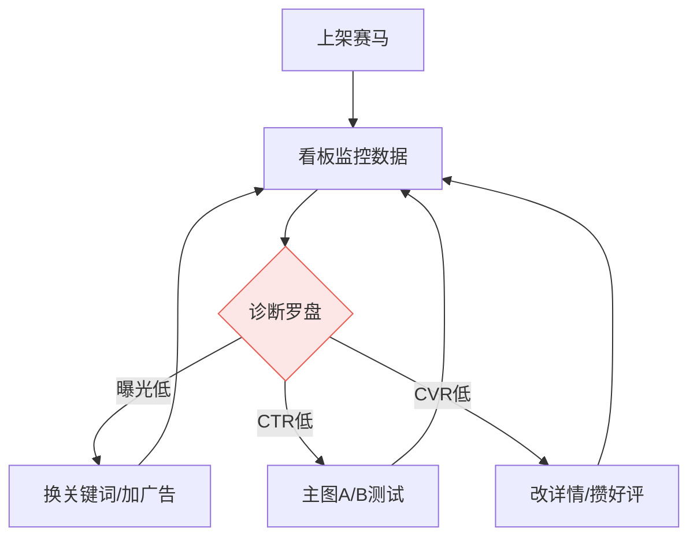

## **第四章 · 匹配侧：喂饱平台算法**

### **4.1 用四步方法论跑匹配侧**

匹配侧的本质是**“信号控制”**。你需要向 Shopee 算法发送正确的信号，让它在对的时间把你的货推给对的人。

#### **① 接受不可知：多个长尾 Listing 同时小流量“赛马”**
不要赌哪个 SKU 会爆，让算法帮你选。
- **动作**：将同一系列的多个长尾 Listing（如：旅行款、宿舍款、专业款）同时上线，开启极小预算的自动广告。
- **逻辑**：看平台自然流量更倾向于给谁“喂”数据。曝光涨得最快、CTR 最高的那个，就是算法认定最匹配当前市场的“种子选手”。

#### **② 系统布局：建立“Listing 数据监控看板”**
匹配不是靠感觉，是靠对漏斗各环的实时掌控。
- **动作**：建立一张看板，横向对比所有 SKU 的**曝光量、CTR、CVR**。
- **逻辑**：将多 SKU 的管理从“手动操作”升级为“看板决策”。只有看清全店的漏斗分布，才能决定预算该压在谁身上。

#### **③ 抓住关键：使用“诊断罗盘”进行精准调度**
拒绝全局乱改，哪里漏水补哪里。
- **动作**：
    - **曝光低**：说明标题关键词与算法匹配度差，改标题。
    - **CTR 低**：说明主图或价格在搜索页没竞争力，做主图 A/B 测试。
    - **CVR 低**：说明详情页没解决差评疑虑，改卖点和评价。
- **逻辑**：一次只动一个变量，确保改动可归因。

#### **④ 极致执行：高频小步迭代主图与关键词**
匹配侧的胜负在于迭代频率。
- **动作**：每 7 天对 CTR 垫底的 20% Listing 强制执行主图更替（换 A/B/C 版）；每 14 天对曝光低的词进行“换血”。
- **逻辑**：算法喜欢活跃的、在持续优化的 Listing。高频的微调能持续刺激算法给流量。

> **【缝纫包注脚】** 
> 1. **赛马**：上线 5 个长尾包，发现“旅行便携款”的自然曝光是其他的 4 倍，果断关掉其他广告，预算全压这一款。
> 2. **看板**：通过看板发现某个 SKU 曝光过万但 CTR 只有 1.5%，立刻触发“主图 A/B 测试”流程。
> 3. **调度**：发现 CVR 低是因为印尼买家在评价里问“有没有黑线”，立刻在详情页置顶位置加上“包含黑白及 10 色常用线”的文字说明。

---

### **4.2 匹配侧的时间节奏（日/周/月动作清单）**

匹配侧的节奏在于**“日监控，周调优”**。

| 周期 | 诊断动作（看） | 优化动作（动） | 目的 |
|---|---|---|---|
| **每日** | 扫一眼广告预算消耗与核心 SKU 排名 | 无（除非消耗异常或排名暴跌） | 监控“漏斗”是否堵塞 |
| **每周** | **对比看板数据**，定出本周“漏水”最狠的 SKU | 对瓶颈环节（主图/标题/详情）执行单变量修改 | 提高全店平均 CTR 和 CVR |
| **每月** | 盘点整店投产比（ROI）与利润率 | 砍掉长期无转化、浪费权重的“死链” | 提纯店铺权重，把流量喂给优等生 |

---

### **4.3 匹配侧的飞轮：从流量匹配到心智占领**

匹配侧的飞轮转起来，意味着算法对你的标签越来越准，获客成本越来越低。

- **微创新（每周）**：给主图加一个“Local Seller / Ready Stock”的小角标，测试对本土买家信任感的提升。
- **常规创新（每月）**：配合平台大促（如 11.11 / 12.12），设计一套限时营销主图，并调整关键词竞价策略抢占首屏。
- **颠覆性创新（每季度）**：通过数据发现某类买家（如手作博主）极高的转化率，联合匹配侧数据反哺需求侧，专门定制一套“博主同款”高端匹配策略。

---

### **本章总结：四步咬合**

匹配侧的四步咬合，是把**“供给”与“需求”通过算法红利完美对接**的过程。

- **接受不可知** 避开了主观押宝。
- **系统布局** 让你拥有了上帝视角的数据雷达。
- **抓住关键** 保证了你每一分钱广告费都花在刀刃上。
- **极致执行** 让你在算法竞争中始终保持先手。

> **【缝纫包注脚】** 匹配侧不转，你的好产品只能躺在仓库里；匹配侧转起来，算法会自动变成你的推销员，把“不锈钢不断针”精准推给那些刚刚搜过“jeans repair”的印尼买家。

---

**【第四章 · 完】**