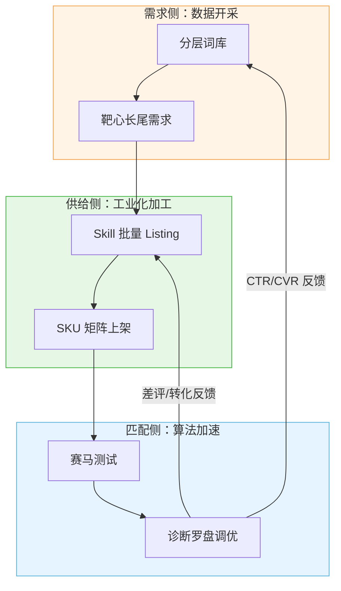

## **第五章 · 三端咬合：完整循环与漏斗诊断罗盘**

### **5.1 机器的总装图：三端闭环系统**

在 Shopee 的生态里，这台机器不是线性流动的，而是**循环互哺**的。匹配侧产生的“硬数据”必须流回需求侧，作为下一轮选品和布局的输入。

### **5.2 终极工具：漏斗诊断罗盘总表**

这是你日常运营的“最高宪法”。当你发现生意不如预期时，**禁止拍脑袋**，必须查表定药方：

| 漏水环节 | 核心指标 | 诊断结论 | 极致执行动作（药方） |
| :--- | :--- | :--- | :--- |
| **入口堵塞** | **曝光量**极低 | 标题没搜到 / 关键词太冷 / 广告没出价 | 1. 重新跑需求侧联想词 2. 换长尾词标题 3. 提高关键词出价 |
| **路过不进** | **CTR** 低于均值 | 主图没吸引力 / 价格太高 / 卖点不显 | 1. 启动主图 A/B 版切换 2. 放大差异化角标 3. 检查价格是否卡在主流区间 |
| **进店不买** | **CVR** 低于均值 | 详情没说服力 / 评价差 / 疑虑未消 | 1. 扒最新差评，更新详情文字区 2. 增加对比图硬证据 3. 用营销工具（加价购）促单 |

### **5.3 创新的三层飞轮节奏（全章汇总）**

你要的“飞起来”，本质上是**在四个时间尺度上保持不同强度的呼吸**：

| 时间尺度 | 创新强度 | 核心动作 | 预期效果 |
| :--- | :--- | :--- | :--- |
| **每周** | **微创新** | 改一处角标、换一个修饰词、调一次出价 | 保持算法活跃度，获取微小领先 |
| **每月** | **常规创新** | 升级 Skill 模板、重构分层词库、改良产品包装 | 建立系统性壁垒，拉开与散户的距离 |
| **每季度** | **颠覆性创新** | 跨品类迁移、建立自有品牌、改变商业模式 | 实现维度打击，从卖货跨越到做生意 |
| **每年** | **机器进化** | 升级整套方法论，适配新的平台算法（如 GEO 趋势） | 确保机器本身不落后于时代 |

---

## **结语：这台机器属于你，而非属于某个品**

到这里，我们已经完成了从 **独立站方法论** 到 **Shopee 工业化机器** 的完整沉淀。

这套方法论的核心价值不在于它能卖掉多少缝纫包，而在于它赋予了你一种**“确定性”**：
1. **不再依赖灵感**：需求是搜出来的，文案是 Skill 生成的。
2. **不再畏惧失败**：因为“接受不可知”，所以每一次失败都是一次有价值的数据回收。
3. **不再四面出击**：因为有“诊断罗盘”，你永远知道今天该把那一小时花在哪个变量上。

> **【最后的缝纫包注脚】** 
> 缝纫包只是这台机器处理的第一个 SKU。当你在看板上看到它的 CTR 趋于平稳、利润自动流进账户时，请不要停下。**带上这台机器，去开采下一个品类。** 独立站是你的实验室，Shopee 是你的加工厂，而这套方法论，就是你通往所有平台的通行证。

---

**《Shopee 方法论沉淀文档 v1.0》· 全文完**
